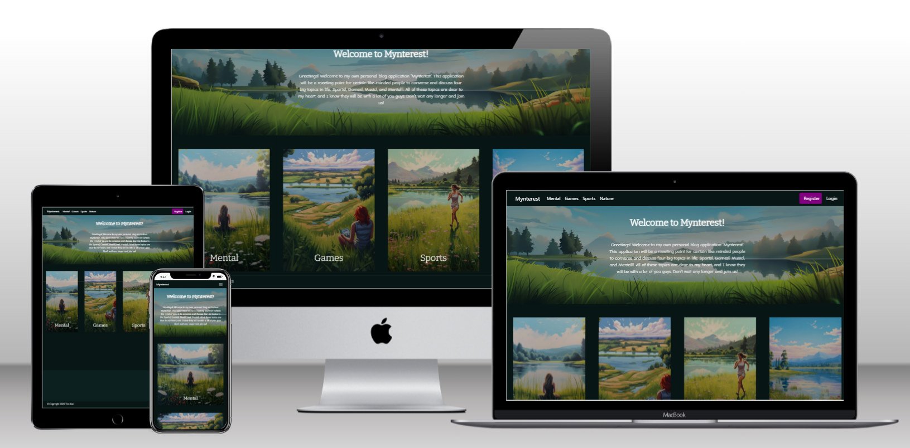
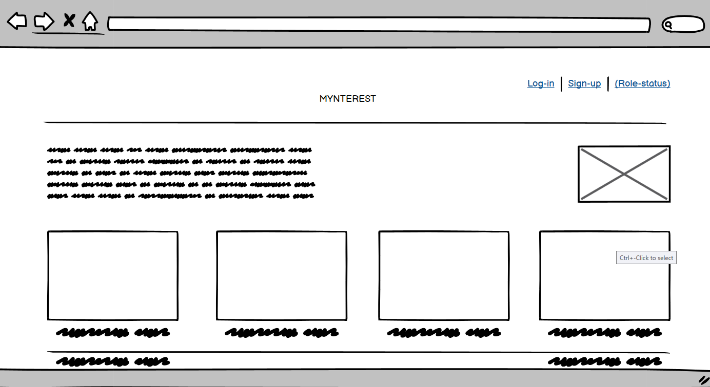
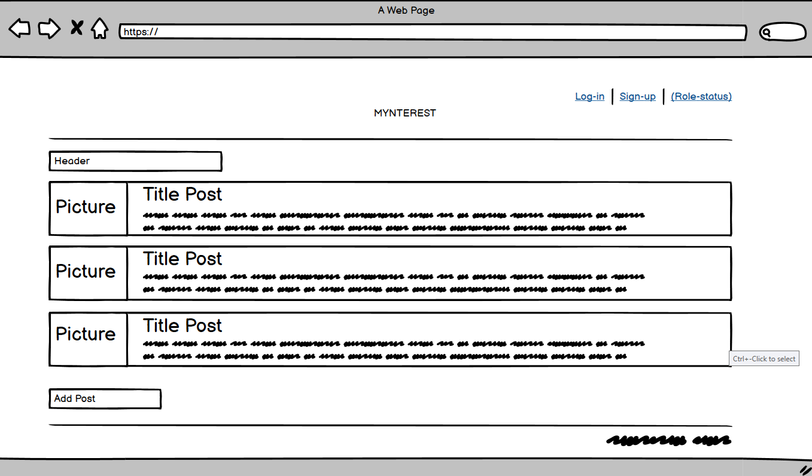
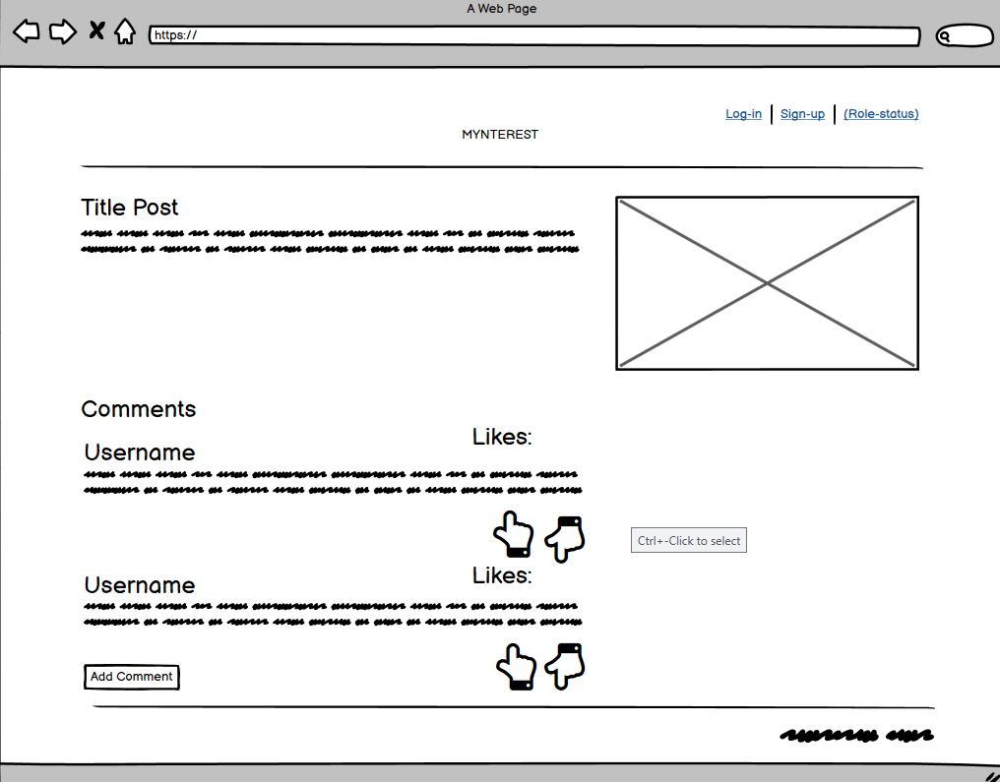
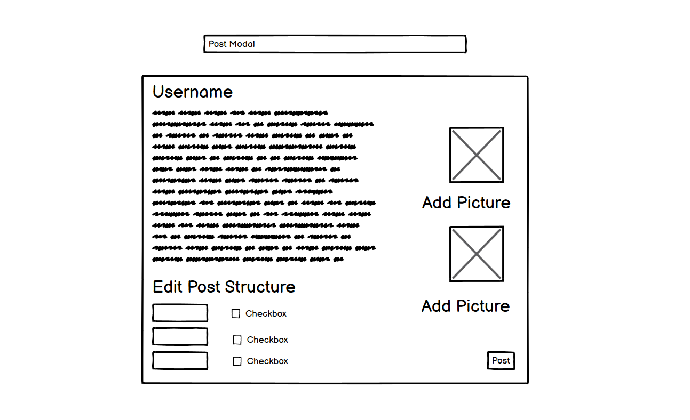
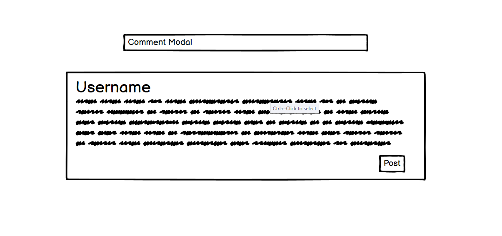
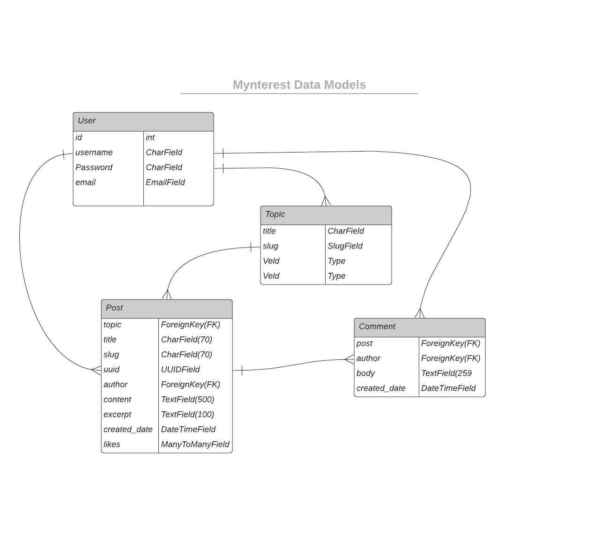

# Mynterest

Mynterest is a personal blog platform (My-Interest) where people with like-minded interests like myself (Mental Health, Sport, Games and Nature) can interact with each other through the creation of posts, comments and liking each other posts. Each of these topics has their own section to visit and interact with. Come and join the party! 

Mynterest is a full-stack web application built with the use of Django. 

# Table of Contents

<ol>
    <li>UX</li>
    <ul>
        <li>Strategy</li>
        <li>User Stories</li>
        <li>Design</li>
        <ul>
            <li>Color Scheme</li>
            <li>Favicon</li>
            <li>Typography</li>
        </ul>
        <li>Wireframes</li>
        <li>Data Scheme</li>
    </ul>
    <li>Features</li>
        <ul>
            <li>Features</li>
            <li>Features for future implementation</li>
        </ul>
    <li>Technologies Used</li>
        <ul>
            <li>Front-End Technologies</li>
            <li>Back-End Technologies</li>
        </ul>
    <li>Testing</li>
        <ul>
            <li>Automated Testing</li>
                <ul>
                    <li>Python</li>
                    <li>Javascript</li>
                </ul>
            <li>Manual Testing</li>
            <li>Validators</li>
            <li>Responsiveness</li>
        </ul>
    <li>Deployment</li>
        <ul>
            <li>Deployment to Heroku</li>
        </ul>
    <li>Credits</li>

## UX 

### Strategy

<strong>Primary Goals</strong>

The purpose of this project was create an blog application that wouldn't have too many sub-topics so that user won't get overwhelmed with too much information and has a clear idea of were to go for which topic. 

The primary goals I have for the projects were as follows:
<ul>
    <strong>Authenticated Users</strong>
    <ul>
        <li>Being able to log in so that they are able to make use of the create, update, delete and like functionality</li>
        <li>Being able to log out so that their account can't be abused</li>
        <li>Being able to create, update and delete their own posts and comments.</li>
        <li>Being able to like their own posts and that of others.</li>
        <li>Being able to view all posts and comments.</li>
    </ul>
    <strong>Unauthenticated Users</strong>
    <ul>
        <li>Being able to register so they are able to create, update and delete their own posts and comments.</li>
        <li>Being able to view the posts and comments made on the application</li>
    </ul>
</ul>

With these project goals in mind, I created the following user stories below.

### User Stories

<strong>"As a Unauthenticated user, I would like to _____________________"</strong>

<ul>
    <li>view and select a list of topics so that I can see the content of each topic.</li>
    <li>View a list of posts so I can choose one that interest me.</li>
    <li>Click on a post so that I can read the full post.</li>
    <li>View the comments on a post so that I can follow the conversation.</li>
    <li>Be able to register for an account so that I can add my own content to the application.</li>
    <li>Be able to navigate to the top of the page more easily so that if a posts page get too long I can easily get back to the top again.</li>
</ul>

An authenticated user will have the same access to the user stories of the unauthenticated user but will be able to access more functionaliy. The user stories below will explain the this functionality.

<strong>"As a Authenticated user, I would like to _____________________"</strong>

<ul>
    <li>Create, Update and Delete my own posts so I can manage my posts to my liking</li>
    <li>Create, Update and Delete my own posts so I can manage the comments I create.</li>
    <li>Log in to my account so I can interact with the application and community.</li>
    <li>Log out of my account so no one else can abuse my account.</li>
    <li>Be able to like/unlike a post so I can show my interest in the post.</li>
</ul>

### Design

As nature being my own favorite topic of them all, I decided to bring back a this element in each page. Each banner and topic show a picture of a person in nature. The color scheme I used also consist mainly of green elements to compliment the overall nature feeling.

#### Color Scheme

<ul>
    <li>Main color for application, #081616</li>
    <li>Background color of overall application,#0c2020</li>
    <li>Color for most buttons. Used so they jump out to the user,purple (#800080)</li>
    <li>Text color,White (#ffffff)</li>
</ul>

#### Favicon

I used a custom favicon icon. These icons were made by a dear friend of mine who will be mentioned in the credits. Three different sized of this favicon have been added for responsiveness.

Default

16x16px

32x32px

#### Typography

I used 2 different fonts that complemented each other well and complemented the further content of the application also. The two fonts I chose were:

<ul>
    <li>Comic Neue, I implemented this font for the whole application.</li>
    <li>Biter, I implemented this font for several elements within the application to make them pop out with the purpose of users being able to spot these elements quickly.</li>
</ul>

### Wireframes

For creating the wireframes I used Balsamiq wireframes because it is easy to use and came with the course. The wireframes were created at the beginning of the design process but since then I have not been able to access the functionality anymore because my subscription expired. Because of this you will see some features that are not implemented in the final project (for example: disliking and adding an image to the postform) and some features that were not necessary (for example: the checkboxes on the postform). Nonetheless I stil used these wireframes as a guide to creating the final project.

<strong>Index Page</strong>

<ul>
    <li>Top left text is the intro text. In the final project version has this been placed inside the index banner.</li>
    <li>Top right image field is the index banner. The initial thought was to place it beside the intro text but in the end I thought it would be better to merge the two together.</li>
    <li>The four fields on the bottom and the text below them are the topic images and their names. The topic images are in the same spot but the names are placed inside the images.</li>
    <li>The text field left and the text field right are the copyright text and the back to top button. Both are placed the same in the final project version.</li>
</ul>

<strong>Posts Page</strong>

<ul>
    <li>The header has been replaced by a banner in the final project which also contains and intro text for each specific topic.</li>
    <li>The picture field has not been added in the final project version.</li>
    <li>The post fields are relatively the same but the amount of likes, creat.</li>
    <li>The add post field in the bottom left has been moved to the top right in the final project version. Also a show most liked button has been added to the top left of the page in the final project.</li>
</ul>

<strong>Post Details Page</strong>

<ul>
    <li>The post has been put into a card class and has been centered in the final project version and the picture field on the top left has not been added.</li>
    <li>The comments field is in the same position in the final project version as the wireframe.</li>
    <li>The comments itself have been put into a card class and have been centered.</li>
    <li>The like button has been removed from the comments and has been added to the post itself. The dislike functionality has not been added to the project.</li>
    <li>The comment button now is a form that has been centered at the bottom. When the user is not authenticated there will be a div with a register button and text.</li>
</ul>

<strong>Post Form</strong>

<ul>
    <li>Username field has not been added in final project version.</li>
    <li>Add picture fields have not been added.</li>
    <li>The checkboxes to edit the post structure have not been added in the final project version.</li>
    <li>The text field has been split up into three section. Post Title, Post content and Post Excerpt.</li>
    <li>The submit button has been moved from the right to the left side of the form.</li>
</ul>

<strong>Comment Form</strong>

<ul>
    <li>The username field has been delete on the comment form in the final project version.</li>
    <li>The text field is relatively the same.</li>
    <li>The submit button has been moved to the left.</li>
    <li>The overall container of the comment form has been made longer for a better user experience.</li>
</ul>

I haven't made any wireframes for the sign up, sign in and sign out forms because the structure was mainly decided but allauth already.

### Data Scheme

This is the database scheme I created for my application. 

## Features

The features that I have added into my application are as follows:

<ul>
    <li>Being able to register to the application so Create, Update, Delete functionality for posts becomes possible.</li>
    <li>Being able to register to the application so Create, Update, Delete functionality for comments becomes possible.</li>
    <li>Being able to log in to the application</li>
    <li>Being able to log out on the application.</li>
    <li>Being able to select a topic to render a list of posts of the given topic.</li>
    <li>Being able to fully view a post by click on the view post button.</li> 
    <li>Being able to like a post when a user is authenticated.</li>
    <li>Being able to remove the users like on post when the user is authenticated.</li>
    <li>Being able to scroll back to the top of the page.</li>
    <li>Paginate the posts and comments so that the page won't become too long.</li>
    <li>Added a authorization check on the create post button.</li>
    <li>Added a authorization check on the like icon.</li>
    <li>Added verification to the comment form so that a user is only allowed to write a comment if they are registered/logged in.</li>
</ul>

### Future Features

The future features that I would like to add into my application are as follows:

<ul>
    <li>Being able to like comments</li>
    <li>Being able to dislike posts.</li>
    <li>Being able to dislike comments.</li>
    <li>Being able to add pictures to the posts in the post form.</li>
    <li>Being able to add pictures to the comments in the comment form.</li>
    <li>Being able to react on other users their posts.</li>
</ul>

## Technologies Used

<ul>
    <li><strong>Gitpod</strong>
    <ul>
        <li>Used as IDE for my coding.</li>
     </li>
    </ul>
    <li><strong>Github</strong></li>
    <ul>
        <li>Used as a remote storage for code online.</li>    
    </ul>
    <li><strong>Balsamiq</strong></li>
    <ul>
        <li>Used to create the wireframes for this application.</li>    
    </ul>
    <li><strong>Google Fonts</strong></li>
    <ul>
        <li>IUsed for the fonts in this application.</li>    
    </ul>
</ul>

### Front-End Technologies

<ul>
    <li><strong>HTML</strong></li>
    <ul>
        <li>Used as a base for the markup text.</li>
    </ul>
    <li><strong>CSS</strong></li>
    <ul>
        <li>Used for styling of application.</li>
    </ul>
    <li><strong>Javascript(jQuery3.5.1)</strong></li>
    <ul>
        <li>Used for interactive functionality.</li>
    </ul>
    <li><strong>Bootstrap5</strong></li>
    <ul>
        <li>CSS framework.</li>
    </ul>
</ul>

### Back-End Technologies

<ul>
    <li><strong>Python3.8.11</strong></li>
    <ul>
        <li>Back-end programming language used for this application.</li>
    </ul>
    <li><strong>Django</strong></li>
    <ul>
        <li>The framework that is used for the appliction.</li>    
    </ul>
    <li><strong>Heroku</strong></li>
    <ul>
        <li>Used for the hosting of this application.</li>
    </ul>
    <li><strong>ElephantSQL</strong></li>
    <ul>
        <li>Used as a hosting platform for data storage.</li>
    </ul>
    <li><strong>Cloudinary</strong></li>
    <ul>
        <li>Used as a hosting platform for static files storage.</li>
    </ul>
</ul>

## Testing

For testing I tried to test as much code as possible through automated testing so there would be as little room left for human errors as possible.
I aimed for a 100% coverage stated by the coverage tool for the models, forms and views. I have made sure that all tests have a docstring to inform the reader what it is testing. All python tests reside in the content application. I tried to move all tests in a separate folder in the root directory but when I tried this, the tests weren't able to connect to the files they were testing.

### Automated Testing

<strong>Python</strong>

<li>Form Testing</li>
<ul>
    <li>Tested to see if post form is invalid with no data.</li>
    <li>Tested to see if post form is valid with valid data
        and that the post can be saved with the valid data.</li>
    <li>Tested to see if comment form is invalid with no data.</li>
    <li>Tested to see if comment form is valid with valid data
        and that the post can be saved with the valid data.</li>
</ul>

All tests have been run by the python3 manage.py test command and passed. All test have been put together in a single testcase. 100% coverage achieved stated by the coverage tool.

<li>Model Testing</li>
<ul>
    <li>Tested to see if title field requirement on the topic model  work properly.</li>
    <li>Tested to see if topic, title, content and excerpt requirement on the post model worked properly.
    </li>
    <li>Tested to see __str__ method on the post model field worked properly.</li>
    <li>Tested to see if the amount of likes method on the post model worked properly.</li>
    <li>Tested to see if the __str__ method on the comment model worked properly.</li>
</ul>

All tests have been run by the python3 manage.py test command and passed. The tests for each model have been put in seperate testcases for a more detailed set up. 100% coverage achieved stated by the coverage tool.

<li>View Testing</li>
<ul>
    <li>Tested to see if home page is loading properly.</li>
    <li>Tested to see if post with most likes render after clicking show most liked button.
    </li>
    <li>Tested to see if all posts are displayed correctly for their given topic.</li>
    <li>Tested to see if unauthenticated user isn't able to create a post and is redirected to the login page and that the error message is shown.</li>
    <li>Tested to see if authenticated user is redirected to the create post page.</li>
    <li>Tested to see if HttpResponseNotAllowed of the AuthCheck view can be triggered.</li>
    <li>Tested to see if post details page is loading properly.</li>
    <li>Tested to see if the GET request for the post details page
        is working properly and if the form is rendered correctly.</li>
    <li>Tested to see if a valid post form is successfully posted 
        and if the post is found in the database with the correct values.</li>
    <li>Tested to see if a invalid post from can't be posted.</li>
    <li>Tested to see if a comment can be made with a valid form.</li>
    <li>Tested to see if a comment can't be created with an invalid form.</li>
    <li>Tested to see if the GET request for the edit post page works properly.</li>
    <li>Tested to see if the POST request works on the edit post page with a valid form.</li>
    <li>Tested to see if the POST request works on the edit post page with a invalid form.</li>
    <li>Tested to see if the GET request for the edit comment page works properly.</li>
    <li>Tested to see if the POST request works on edit comment page with a valid form.</li>
    <li>Tested to see if the POST request works on edit comment page with a invalid form.</li>
    <li>Tested to see if an authenticated user can like a post.</li>
    <li>Tested to see if an authenticated user can unlike a post.</li>
    <li>Tested to see if a unauthenticated user isn't able to like and is redirected to the login page and the error message will show.
    </li>
    <li>Tested to see if authenticated user can like and will be redirected to the post details page of the given post.
    </li>
    <li>Tested to see if HttpResponseNotAllowed
        of the AutCheckLike view can be triggerd.</li>
    <li>Tested to see if post can be deleted.</li>
    <li>Tested to see if comment can be deleted.</li>
    <li>Tested to see if authorization will fail if a unauthenticated user tries to delete a comment.</li>
    <li>Tested to see if the exception handling for the get method of the PostList view works.</li>
    <li>Tested to see if the exception handling for the get method of the PostDetail view works.</li>
    <li>Tested to see if the exception handling for the post method of the PostDetail view works.</li>
    <li>Tested to see if the exception handling for the get method of the CreatePost view works.</li>
    <li>Tested to see if the exception handling for the post method of the CreatePost view works.</li>
    <li>Tested to see if the exception handling for the get method of the EditPost view works.</li>
    <li>Tested to see if the exception handling for the post method of the EditPost view works.</li>
    <li>Tested to see if the exception handling for the get method of the EditComment view works.</li>
    <li>Tested to see if the exception handling for the post method of the EditComment view works.</li>
    <li>Tested to see if the exception handling for the post method of the PostLike view works.</li>
    <li>Tested to see if the exception handling for the get method of the DeletePost view works.</li>
    <li>Tested to see if the exception handling for the get method of the DeleteComment view works.</li>
</ul>

I put all the tests of the view in one single testcase because I only had to make one big set up and small adjustments for each test rather than having to create a large setup for every individual testcase. 100% coverage achieved stated by the coverage tool.

<strong>Javascript</strong>

<ul>
    <li>Tested to see if back to top button scrolls back to the top after being clicked.</li>
    <li>Tested to see if the alert message closes after a 1500ms delay.</li>
</ul>

All test have been run by the npm test command and both tests passed. I haven't added more javascript because I didn't need more than I already have in this application.

### Manual Testing

I believe I was able to cover everything I could through the automated testing of all my code. Therefore I didn't know what else I could test through manual testing. 

### Validators

[W3C HTML Validator](https://validator.w3.org/) - I had to run each individual page through the validator by the page source because if I didn't I would be error for my django templating. By doing it this way I had now HTML validators errors or warnings on my pages.

[W3c CSS Validator](https://jigsaw.w3.org/css-validator/) - No errors or warnings were found by in my style.css by this CSS validator.

[Flake8](https://flake8.pycqa.org/en/latest/) - I used the flake8 tool to properly style my python code. I have resolved all errors from my own code except for an unused env error in my settings.py. I couldn't figure out as I believed I was using the variable the right way. After some investigation on I found out that the linter couldn't detect it so I decided to keep it in. I also didn't change any errors that were not my own code or code that I didn't fabricate myself like the migrations files. I didn't change the syntax of the migrations folders when they were created so I believe it would be considered okay.

[PEP8 Style Guide](https://peps.python.org/pep-0008/) - I used the PEP8 Style Guide with my Flake8 tool to follow the python coding conventions as much as I could.

### Responsiveness

For the responsiveness of this application I used a mixture of bootstrap classes for their grid system and media queries. The main bootstrap classes that I used are:

<ul>
    <li>col-lg</li>
    <li>col-md</li>
    <li>col-sm</li>
</ul>

Most of these classes have a breakpoint added to them to fix the responsiveness for desktop, tablet and mobile device.

Example:
<ul>
    <li>col-md-6</li>
    <li>col-sm-12</li>
    <li>col-lg-3</li>
</ul>

After adding these classes I adjusted some element that didn't respond smoothly with media queries.

Note: The Mock Up above does not break properly on the tablet device but through the inspector I used multiple tablets devices with different widths and height to validate that the responsiveness does indeed work for tablets.

Tablets I used in to check tablet responsiveness:
<ul>
    <li>iPad Mini</li>
    <li>Surface Pro 7</li>
</ul>

## Deployment

I performed these steps in order to get my application run on Heroku. I used ElephantSQL for hosting my back-end database and Cloudinary as hosting platforms for my static files.

### Deployment to Heroku
<ol>
    <li>Created Repository</li>
    <li>Installed Django</li>
    <li>Installed gunicorn</li>
    <li>Installed psycopg2</li>
    <li>Installed Cloudinary</li>
    <li>Created requirements.txt</li>
    <li>Created Django Project</li>
    <li>Created app</li>
    <li>Add app to settings.py</li>
    <li>Migrate the changes</li>
    <li>Pushed changes to GitHub.</li>
    <li>Run python3 manage.py runserver to verify that the skeleton has been build.</li>

   
    <li>Created a Heroku App</li>
    <li>Created a ElephantSQL database</li>
    <li>Created a Cloudinary database</li>
    <li>Created env.py and added secret variables(CLOUDINARY_URL, SECRET_KEY and DATABASE_URL)</li>
    <li>Modified settings.py to use the env.py files variables, enable the use of the ElephantSQL database and set up cloudinary to store media and static files.</li>
    <li>Set up static files.</li>
    <li>Migrate to the databases that have just been set up.</li>
    <li>Set up Heroku Config Vars</li>
    <li>Created ProcFile.</li>
    <li>Pushed changes to GitHub.</li>
    <li>Deployed app in Heroku.</li>
</ol>

## Credits

I would like to thank one of my best friends [Thomas Huijbens](https://www.thomashuijbens.net/) for helping me get the artwork I wanted for my project. Thomas Huijbens is a graphic designer based in the Netherlands who was able to provide me with some amazing artwork. Without him this project probably wouldn't have felt the same. 
Finally I also want to thank all my friends and family for encouraging me to continue working on this course during challenging times. Without them I wouldn't have been able to finish this milestone project and with them by my side I will finish this course.

